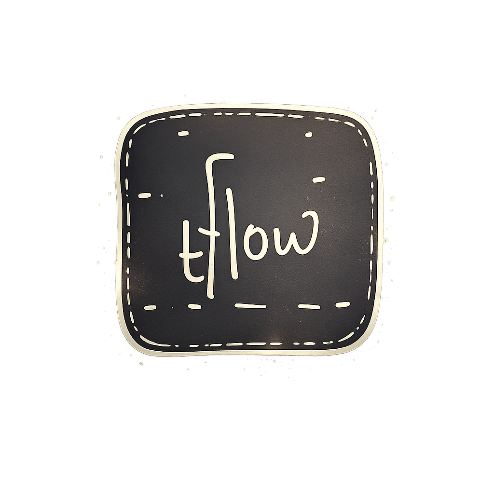
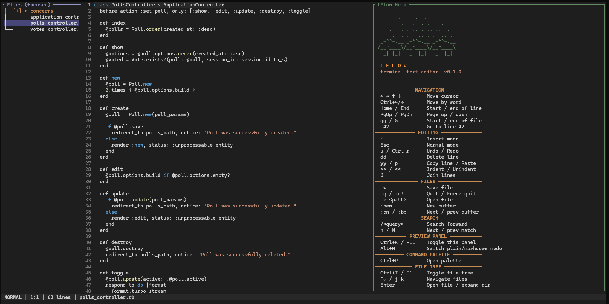

<div align="center">
  
  <h1>tFlow (Beta)</h1>
  <p><strong>Terminal-native text editor with vim-inspired modal editing</strong></p>
  <p>
    
  </p>
</div>

---

## Features

- **Vim-inspired modal editing** — Normal, Insert, Visual, Visual Line, Command, Search modes
- **Search with highlighting** — `/` to search, all matches highlighted in gold, current match brighter + bold, match count in statusline (`[2/5]`)
- **Match cycling** — `n` / `N` cycle forward/backward through matches with wrapping
- **Auto-clear** — Press `Esc` or start typing to dismiss search highlights
- **Rope-based engine** — Handles 100k+ line files with low latency
- **Syntax highlighting** — Language-aware coloring for JavaScript, Python, Rust, JSON, Markdown, and more
- **Markdown rendering** — Headings, tables, lists, code blocks, blockquotes, checkboxes
- **Split panes** — Horizontal (`:sp`) / vertical (`:vs`) splits, keyboard-driven navigation (`Alt+w`/`Alt+q`)
- **Workspace grep** — Full-text search across workspace files
- **Full undo/redo** — With change-grouping for natural history
- **Clipboard** — System clipboard integration (copy, cut, paste)
- **Multi-buffer** — Switch between open files
- **Fuzzy file finder** — `Ctrl+P` search and open any workspace file
- **Command palette** — `Ctrl+Shift+P` fuzzy-find any command
- **User config** — TOML config at `~/.config/tflow/config.toml`
- **Word wrap** — `:wrap` to toggle, enabled by default
- **5 themes** — retro_green (default), amber, synthwave, tokyo_night, default_dark
- **Autosave + recovery** — Background auto-save and crash recovery files

---

## Install

### From source

```bash
git clone https://github.com/Simangka/tFlow.git
cd tFlow
cargo build --release
cp target/release/tflow ~/.local/bin/
# Or on Windows:
copy target\release\tflow.exe %USERPROFILE%\.cargo\bin\tflow.exe
```

Or install globally via cargo:

```bash
cargo install --path .
```

Or run directly without installing:

```bash
cargo run -- notes.md
```

### Requirements

- Rust 1.75+
- A truecolor terminal (Windows Terminal, Kitty, Alacritty, iTerm2, GNOME Terminal)

---

## Usage

### Opening & creating files

```bash
tflow notes.md              # open a file
tflow a.md b.txt            # open multiple files
tflow .                     # open current directory as workspace
tflow notes.md:120          # open at line 120
cat notes.md | tflow        # pipe from stdin
```

### Creating files and directories from CLI

```bash
tflow -w app.txt            # create a single empty file
tflow -w main.py utils.js   # create multiple files
tflow -d src                # create a directory
tflow -d src lib            # create multiple directories
tflow -w app.txt -d src     # mix files and directories
```

### Modes

tFlow uses a vim-inspired modal system:

| Mode | Enter | Purpose |
|------|-------|---------|
| **Normal** | `Esc` | Navigate and manipulate text |
| **Insert** | `i` / `a` | Type and edit text |
| **Visual** | `v` | Select text |
| **Visual Line** | `V` | Select whole lines |
| **Command** | `:` | Run commands |
| **Search** | `/` | Find and highlight text |

---

### Keybindings

#### Normal mode

| Key | Action |
|-----|--------|
| `h` `j` `k` `l` | Move cursor |
| `w` `b` | Word forward / backward |
| `0` `^` | Start of line |
| `$` | End of line |
| `gg` | Start of file |
| `G` | End of file |
| `%` | Matching brace |
| `Ctrl+u` `Ctrl+d` | Half page up / down |
| `Ctrl+b` `Ctrl+f` | Page up / down |
| `i` `a` | Insert mode (before / after cursor) |
| `I` `A` | Insert at line start / end |
| `o` `O` | Insert new line (below / above) |
| `v` | Visual mode |
| `V` | Visual line mode |
| `x` `X` | Delete character forward / backward |
| `dd` | Delete line |
| `yy` | Copy (yank) line |
| `p` `P` | Paste after / before cursor |
| `u` | Undo |
| `Ctrl+r` | Redo |
| `>` `<` | Indent / Unindent |
| `D` | Delete to end of line |
| `J` | Join lines |
| `n` | Next search match |
| `N` | Previous search match |

#### Insert mode

| Key | Action |
|-----|--------|
| `Esc` | Return to Normal mode |
| `Ctrl+c` | Return to Normal mode |
| `Backspace` | Delete character backward (hides completion) |
| `Delete` | Delete character forward (hides completion) |
| `Enter` | Accept completion, or insert newline |
| `Tab` | Accept completion, or insert tab |
| `↑` / `↓` | Navigate completion list |

#### Visual mode

| Key | Action |
|-----|--------|
| `h` `j` `k` `l` | Extend selection |
| `Esc` | Clear selection |
| `x` `d` | Cut selection |
| `y` | Copy selection |

#### Search mode

| Key | Action |
|-----|--------|
| `/` | Enter search mode (forward) |
| Type query | Characters appended to search buffer |
| `Enter` | Execute search, jump to first match |
| `Esc` | Cancel search, clear highlights |
| `Backspace` | Remove last character |
| `n` | Next match (after search) |
| `N` | Previous match (after search) |

Search highlighting is automatically cleared when you start editing or press `Esc` in Normal mode.

#### Command mode

| Command | Action |
|---------|--------|
| `:w` | Save file |
| `:w <file>` / `:save <file>` | Save as (sets buffer filename) |
| `:q` | Quit (closes pane if in split, quits app if single) |
| `:wq` | Save and quit |
| `:q!` | Force quit |
| `:e <file>` | Open file |
| `:new` | New buffer in horizontal split |
| `:vnew` | New buffer in vertical split |
| `:sp` / `:split` | Horizontal split with current buffer |
| `:sp <file>` / `:split <file>` | Open file in horizontal split |
| `:vs` / `:vsplit` | Vertical split with current buffer |
| `:vs <file>` / `:vsplit <file>` | Open file in vertical split |
| `:close` | Close current split pane |
| `:wrap` | Toggle word wrap on/off |
| `:branch` / `:br` / `:branches` | Toggle branch log viewer |
| `:help` | Show help screen |

#### File tree (`F1` / `Ctrl+T`)

| Key | Action |
|-----|--------|
| `↑` / `k` | Navigate up |
| `↓` / `j` | Navigate down |
| `Enter` / `→` / `l` | Expand directory / open file |
| `←` / `h` | Collapse directory |
| `Esc` / `Tab` | Return focus to editor |

#### Split panes

| Key | Action |
|-----|--------|
| `Alt+h` | Horizontal split |
| `Alt+v` | Vertical split |
| `Alt+w` | Focus next pane |
| `Alt+q` | Close current pane |

#### Global

| Key | Action |
|-----|--------|
| `Ctrl+s` | Save |
| `Ctrl+q` | Quit |
| `Ctrl+p` | Fuzzy file finder |
| `Ctrl+Shift+P` | Command palette |
| `Ctrl+t` / `F1` | Toggle file tree |
| `g b` | Toggle inline git blame |
| `g s` | Toggle staging panel |
| `g r` | Toggle branch log viewer |
| `F12` / `Alt+t` | Toggle integrated terminal |
| `Ctrl+\` | Focus terminal |
| `:blame` | Toggle inline git blame |
| `:status` / `:st` | Toggle staging panel |
| `:branch` / `:br` / `:branches` | Toggle branch log viewer |
| `:terminal` / `:term` | Toggle integrated terminal |
| `:stage` | Stage current buffer |
| `:unstage` | Unstage current buffer |
| `:stageall` | Stage all files |
| `Ctrl+k` / `F11` | Toggle help preview |

---

### Search in detail

1. Press `/` to enter search mode
2. Type your query (matches are found as you type)
3. Press `Enter` to confirm — all matches get a gold highlight, current match is brighter
4. Statusline shows `[current/total]` (e.g. `[2/5]`)
5. Press `n` to cycle forward, `N` to cycle backward (wraps around)
6. Press `Esc` to dismiss highlights, or just start typing — edits auto-clear highlights

---

### Configuration

Config file at `~/.config/tflow/config.toml`:

```toml
theme = "retro_green"

[line_numbers]
enabled = true
relative = false

[editor]
tab_width = 4
autosave = true
cursor_blink_period_ms = 500
scrolloff = 3
word_wrap = true
history_size = 1000

[markdown]
preview_width_ratio = 0.5
live_preview = true

[ui]
show_statusbar = true
show_commandbar = true
```

#### Themes

| Theme | Description |
|-------|-------------|
| `retro_green` | Phosphor green CRT aesthetic (default) |
| `amber` | Warm amber terminal glow |
| `synthwave` | Purple/cyan synthwave retro |
| `tokyo_night` | Blue-based Tokyo Night |
| `default_dark` | Modern dark theme |

---

---

### Git integration

tFlow includes two optional Git features toggled on demand (zero UI impact when hidden):

#### Inline blame (`:blame` / `g b`)

Press `:blame` or `g b` (g then b in normal mode) to show author and time-ago for each line in the current buffer.

```
1  simangka 3d  let x = 42;
2  simangka 3d  fn hello() {
3  jdoe     12h    return "hi";
4  jdoe     12h  }
```

Press `:blame` or `g b` again to hide the blame gutter.

#### Staging panel (`:status` / `g s`)

Press `:status` (or `:st`) or `g s` to open a right-side panel showing changed files:

| Symbol | Meaning |
|--------|---------|
| `?` | Untracked (new file on disk, unknown to git) |
| `m` | Modified (working copy differs from index) |
| `+` | Staged (added to index, ready to commit) |

Inside the panel:

| Key | Action |
|-----|--------|
| `↑` / `k` | Move selection up |
| `↓` / `j` | Move selection down |
| `Enter` | Stage / unstage selected file |
| `Space` | Expand / collapse hunks (diff preview) |
| `Esc` / `Tab` | Close panel |

Workflow:

1. Edit a file in a git repository
2. `:status` to see what changed
3. `↓` to select a file, `Enter` to stage it (`m` → `+`)
4. Select another file, `Enter` to stage it
5. Press `Esc` to close the panel
6. Run `git commit -m "message"` in your terminal to commit

To unstage, open the panel, select a `+` file, and press `Enter` again.

#### Branch log viewer (`:branch` / `g r`)

Press `:branch` (or `:br` / `:branches`) or `g r` to open a right-side panel showing the git commit graph:

```
● 3b845e6 (master) feat: git integration (inline blame, staging panel) + README docs
│
● ee77e29 docs: add save-as to README
│
● e671371 fix: refresh file tree after save so new files appear immediately
```

Inside the panel:

| Key | Action |
|-----|--------|
| `↑` / `k` | Move selection up |
| `↓` / `j` | Move selection down |
| `Esc` / `Tab` | Close panel |
| `Enter` | Switch to the selected branch (via checkout) |

The graph visualises branching and merging with Unicode line-drawing characters:
- `●` — regular commit, `○` — merge commit
- `│` — continuing branch line
- `├` / `┤` — branch fork / merge
- `└` / `┘` — branch end
- `╱` / `╲` — lane transitions
- Coloured dots and lines for different branches (not yet implemented)

> **Note:** The branch graph is an early implementation. It works for linear and simple branching histories. Complex histories with multiple active branches may show visual artifacts. Improvements are planned (see TODO).

---

## LSP Integration (Beta)

tFlow includes built-in language server protocol (LSP) support for completions, diagnostics, hover, go-to-definition, and more. The LSP manager starts language servers on demand when you open a matching file type.

### Supported languages & servers

| Language | Server | Features |
|----------|--------|----------|
| Python | `pyright-langserver` | Completions, diagnostics, hover, go-to-definition, references, semantic tokens |
| Rust | `rust-analyzer` | Completions, diagnostics, hover, go-to-definition, references, semantic tokens |
| JavaScript / TypeScript / JSX / TSX | `typescript-language-server` | Completions, diagnostics, hover, go-to-definition, references, semantic tokens |
| C / C++ | `clangd` | Completions, diagnostics, hover, go-to-definition, references |

> **Note:** Make sure the relevant language server is installed and available in your `PATH`.

### Completions

tFlow triggers completions automatically while typing in Insert mode:

| Trigger | Behavior |
|---------|----------|
| Type any alphanumeric/underscore characters | Completion pops up after ~80ms of idle typing |
| `↑` / `↓` | Navigate through the completion list |
| `Enter` / `Tab` | Accept the selected completion |
| `Esc` / `Backspace` / `Delete` / type a non-word character | Dismiss the completion popup |

Completions are sorted client-side so that prefix-exact matches appear first, then substring matches, then the rest. Accepted completions replace the word prefix at the cursor.

### Diagnostics

When you open a file with LSP support, tFlow connects to the language server and displays diagnostics (errors, warnings, info) in the status line:

```
NORMAL | 1:1 | 42 lines | main.py  2E 3W
```

### Server lifecycle

- Servers start automatically when the first matching file is opened
- Servers shut down gracefully when tFlow exits
- If a server crashes, tFlow logs the error and continues working (restart by reopening the file)

### Requirements

Install the language server(s) you need:

```bash
# Python
npm install -g pyright

# Rust (via rustup)
rustup component add rust-analyzer

# JavaScript / TypeScript
npm install -g typescript-language-server

# C / C++
# Install clangd via your package manager:
#   Ubuntu: apt install clangd
#   macOS:  brew install llvm
#   Windows: Install LLVM from https://llvm.org
```

---

```
src/
  app/           Application state, event loop, action dispatch
  core/          Text buffer (ropey), Position, Range, types
  ui/            Layout calculation, statusline, panels
  input/         Crossterm event stream with tick events
  commands/      Action enum, keymap, command registry, palette
  editor/        Cursor, selection, modes, history, edit operations
  markdown/      Help screen and preview rendering
  rendering/     Render engine, line numbers, scrollbar, search highlighting
  theme/         Color schemes (5 themes), syntax highlighter
  config/        TOML config loading and CLI merge
  workspace/     File tree browser, workspace grep searcher
  async_tasks/   Background task queue (autosave, file watching)
  plugins/       Plugin system architecture (future WASM)
```

---

## Integrated Terminal

Press `F12` or `Alt+t` (or `:terminal` / `:term` in command mode) to open and close the integrated terminal panel at the bottom of the editor.

```
┌──────────────────────────────────────┐
│  Editor                              │
├──────────────────────────────────────┤
│  cmd  powershell                     │
│  C:\> opencode                       │
│  C:\> claude                         │
│  >_                                  │
│  >  cmd | 80x12                      │
└──────────────────────────────────────┘
```

### Features

- **Full PTY support** — runs any CLI tool including AI agents (opencode, claude code, codex) with proper terminal emulation
- **Fixed ConPTY stuck-state** — subprocess exits (opencode, vim, etc.) no longer leave the terminal frozen; auto-recovers within seconds
- **Multiple tabs** — switch between terminal instances with `Ctrl+Tab` / `Ctrl+Shift+Tab`
- **Configurable position** — terminal can be placed at bottom, top, or right side (use `g t` to cycle positions)
- **Scrollback** — `Shift+↑` / `Shift+↓` or `PageUp` / `PageDown` to scroll through output
- **Tab management** — spawn new tabs with `:term powershell`, close with `Esc`
- **Shell detection** — defaults to `cmd.exe` on Windows, `bash` on Unix
- **Theme-aware** — uses your current tFlow theme colors

### Keyboard shortcuts

| Key | Action |
|-----|--------|
| `F12` / `Alt+t` | Toggle terminal |
| `Ctrl+\` | Focus terminal |
| `Esc` | Unfocus terminal (return to editor) |
| `Ctrl+Tab` | Next terminal tab |
| `Ctrl+Shift+Tab` | Previous terminal tab |
| `Shift+↑` / `PageUp` | Scroll up |
| `Shift+↓` / `PageDown` | Scroll down |
| `g t` | Cycle terminal position (bottom → right → top) |

### Tutorial: Using the integrated terminal

1. **Open the terminal** — Press `F12` or `Alt+t` (or type `:terminal` in command mode)
2. **Run commands** — Type any command like you would in a normal terminal:
   ```
   C:\Users\you> dir
   C:\Users\you> cd projects
   C:\Users\you> npm run dev
   ```
3. **Run AI agents** — The terminal supports interactive TUI programs:
   ```
   C:\Users\you> opencode
   C:\Users\you> claude
   ```
   After the agent exits, you return to the shell prompt automatically.
4. **Switch focus** — Press `Ctrl+\` to focus the terminal panel, or `Esc` (inside terminal handler) to return to the editor
5. **Multiple tabs** — Press `Ctrl+Tab` for the next tab, `Ctrl+Shift+Tab` for the previous tab. Spawn a new tab with `:term powershell`
6. **Scroll** — Use `PageUp`/`PageDown` or `Shift+↑`/`Shift+↓` to scroll through terminal output
7. **Close the terminal** — Press `F12` or `Alt+t` again, or type `exit` in the shell then press `Esc`
8. **When the terminal gets stuck** — If a subprocess (like opencode) exits and the terminal appears frozen, wait a few seconds and it will auto-restart. You can also press any key to trigger a restart, or press `F12` to suspend to the host shell and then `exit` to return.

### Commands

| Command | Action |
|---------|--------|
| `:terminal` / `:term` | Toggle terminal |
| `:term <shell>` | Open new terminal tab with specified shell |

### Configuration

Add to `~/.config/tflow/config.toml`:

```toml
[terminal]
position = "bottom"    # "bottom", "top", or "right"
height = 12            # terminal panel height in rows (for top/bottom)
width = 40             # terminal panel width in columns (for right)
```

---

## Roadmap / TODO

Upcoming features planned:

| Feature | Status |
|---------|--------|
| Word completion (buffer-scan) | 🔜 Planned |
| Fuzzy file finder (Ctrl+P) | ✅ Done |
| Split panes (vertical/horizontal) | ✅ Done |
| Session save/restore | 🔜 Planned |
| Multi-cursor (Ctrl+D) | 🔜 Planned |
| Macro recording/playback | 🔜 Planned |
| Bookmarks (m' / ') | 🔜 Planned |
| **Integrated terminal (F12 / :term)** | ⚠️ **Mostly working — ConPTY stuck-state fixed** |
| LSP integration (completions, diagnostics, go-to-def) | ⚠️ **Works but needs optimization** |
| Git integration (inline blame, staging panel) | ✅ Done |
| **Branch graph log (`:branch` / `g r`)** | ⚠️ **Needs more work** |
| Live markdown preview | 🔜 Planned |
| Diagnostics gutter | 🔜 Planned |

> **⚠️ Integrated terminal — needs more work:**
> The terminal is a first pass with basic PTY support. Known limitations:
> - No copy/paste support
> - No search in terminal scrollback
> - Only tested on Windows (cmd.exe)
> - **Fixed:** ConPTY v2 pipe-break on subprocess exit (e.g. opencode, vim)
>   was causing the terminal to appear stuck after the subprocess exited.
>   The reader thread now waits up to 30s and verifies the shell is still
>   alive before giving up. The terminal auto-restarts when detected stuck.
>
> Contributions and improvements welcome.

> **⚠️ Branch graph — needs more work:**
> The commit graph renderer is a first pass and has known limitations:
> - Only tested on linear / single-branch histories
> - Multi-branch layouts may produce overlapping lines
> - No colour-coding for different branches yet
> - Connector rows can appear at the end of the graph
> - Performance not yet optimised for large repos with thousands of commits
>
> Contributions and improvements welcome.

---

## Built with Rust

Uses [ratatui](https://github.com/ratatui-org/ratatui), [crossterm](https://github.com/crossterm-rs/crossterm), [ropey](https://github.com/cessen/ropey), [tree-sitter](https://tree-sitter.github.io/), [tokio](https://tokio.rs/), and more.
